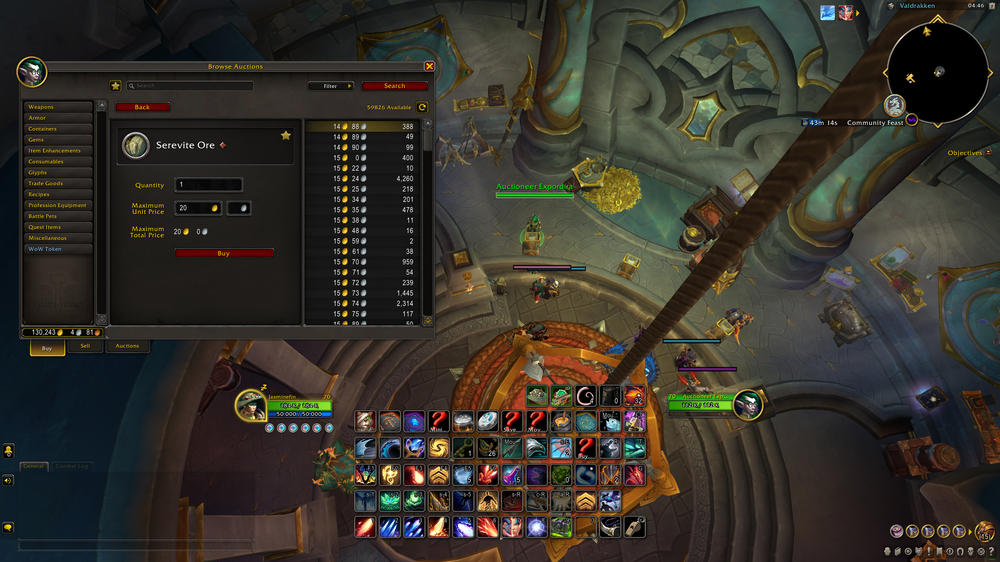

# Commodities Buyer

An add-on which modifies the auction house commodities buying interface so that one can buy commodities with one click. This is implemented with an input for the maximum price per unit. If the amount of commodities specified can be bought with a price per unit smaller or equal the specified maximum price per unit, the commodities are bought direcly after pressing "Buy".

